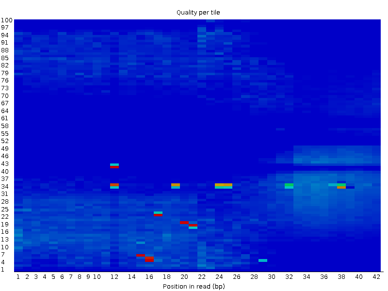
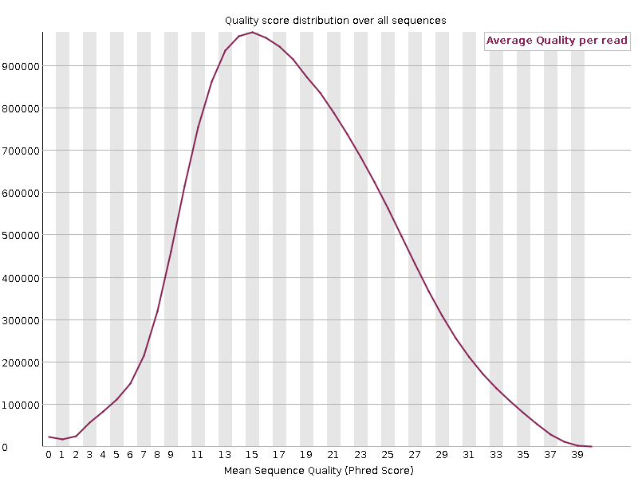
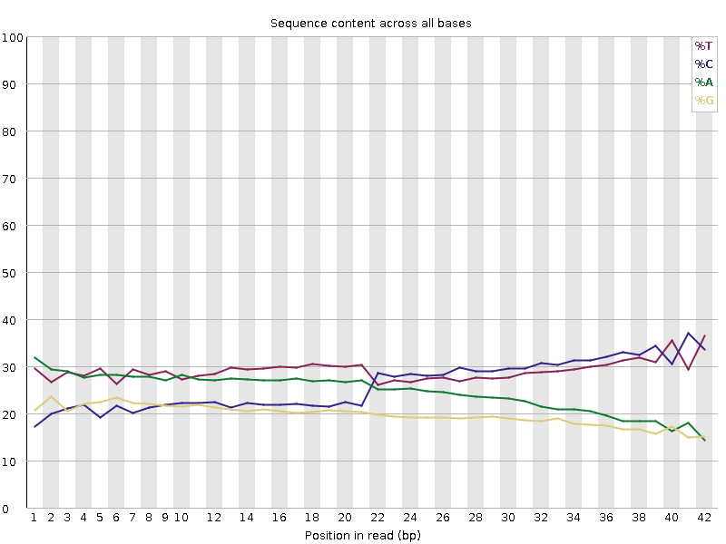
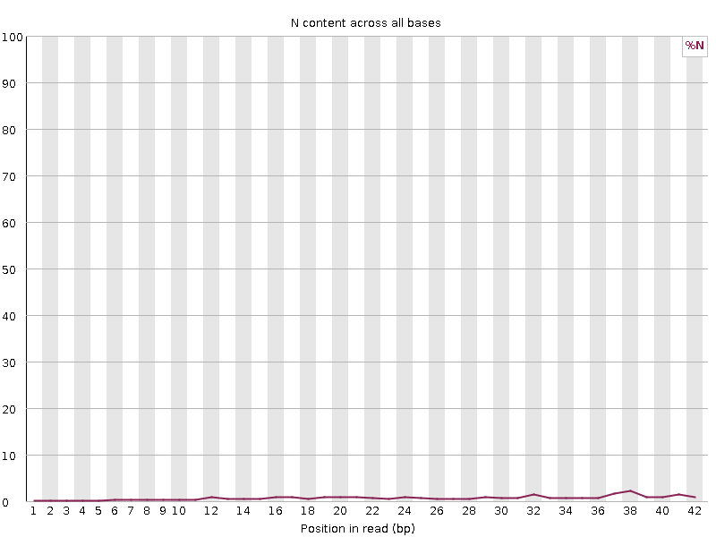
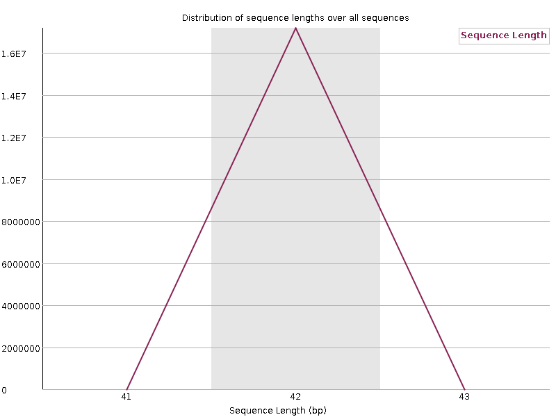
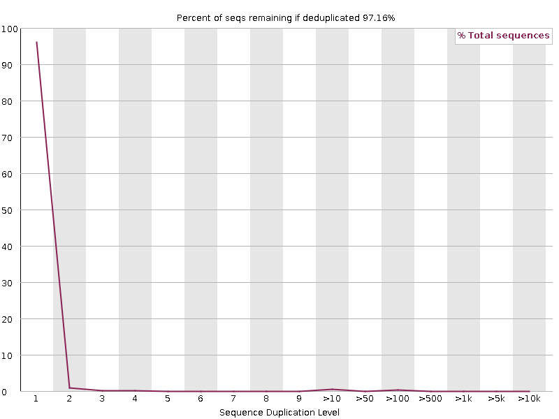
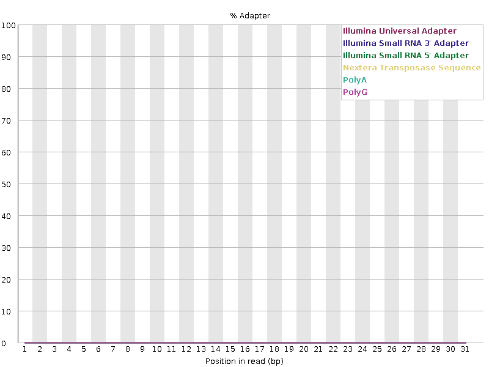

## • Using bwa index de e. coli genome
a
**Suazo:**

```{bash, eval = F}
module load bwa/0.7.17

bwm index Escherichia_coli_K12_MG1655.fasta
```

This would create multiple files 

|Archive|Description|
|---|---|
|.amb|Contain Infromation about ambigous bases (N) in the sequence.|
|.ann|Contain Annotation about genome, like sequences names and lenghts.|
|.bwt|Contain compressed representation of the genome using Burrows-Wheeler algorithm.|
|.pac|Contain packed genome sequence in 2 bits per base. It is used to search the genome.|
|.sa|Contain the suffix array of the genome.|

## • Align reads from a FNR ChIP-seq experiment

**Suazo:**

```{bash, eval = F}
bwa mem Escherichia_coli_K12_MG1655.fasta SRX189773_FNR_ChIP.fastq 
```

This will generate a SAM file with the alignment of the reads to the genome.

> Preview:

```{bash, eval = F}
@SQ	SN:NC_000913.2	LN:4639675
@PG	ID:bwa	PN:bwa	VN:0.7.17-r1188	CL:bwa mem Escherichia_coli_K12_MG1655.fasta SRX189773_FNR_ChIP.fastq
SRR576933.1	0	NC_000913.2	914875	60	36M	*	0	0	AAGCATGGAATAACCGCCTGGTGAATGCTCGCCATA EDEA=EEEEEBFBDFDEBDAD=DDBAC5CCEEE:E@	NM:i:0	MD:Z:36	AS:i:36	XS:i:0
SRR576933.2	0	NC_000913.2	147284	60	36M	*	0	0	TGGAGGCTGACCACGATAAGCTGCCGCTGGTGGTGC	EDF:D?=DEEE?EEE5DDDAEB:ECEBBEA>AA956	NM:i:0	MD:Z:36	AS:i:36	XS:i:0
SRR576933.3	0	NC_000913.2	1572373	60	36M	*	0	0	AGTGCGATGCCGTTCACCCGGTTTTCTTTATCATTA	EEEEED=DD?AD=DDEEBEDEBBECCD>>>BB?EE5	NM:i:0	MD:Z:36	AS:i:36	XS:i:0

```
## • Using the available indexed genomes in the cluster (/mnt/Archives/genome/) align reads of a mouse ChIP-seq experiment to the genome.

> • Please analyze the quality of the data, try using fastqc ;)

**Ferro**:
What is FASTQC?

One of the essential steps in research on the molecule of life is its sequencing. Once the samples have been extracted, the sequencing process is carried out to obtain the nucleotide sequence of the samples. Currently, the new sequencing technology "...can generate hundreds of thousands of sequences in a single run." (Babraham institute). But it should be mentioned that before doing an analysis of the sequences to reach a conclusion, it is important to do a simple quality control on the fastq files, to observe how well the raw files look for future analysis and thus avoid biases that can affect the research.

To do quality tests for fastq files, there is the **FASTQC** tool, whose output is a report of the problems that arose in the sequencer or in the start library.This tool can be run in two different modes, the first is as a stand-alone interactive application that can perform a quick analysis with a few fastq files or as a non-interactive mode, where the analysis process is larger, since it does
a "...systematic processing of large amounts of files." (Babraham institute)

To use the tool fastqc I charged the module *fastqc/0.12.1* to start the analysis of the quality of the data. 

Ref:<https://www.bioinformatics.babraham.ac.uk/projects/fastqc/Help/1%20Introduction/1.1%20What%20is%20FastQC.html>

```{bash, eval = F}
module load fastqc/0.12.1

module list
Currently Loaded Modulefiles:
  1) gcc/5.1.0         2) sge/2011.11p1     3) bcftools/1.10.2   4) fastqc/0.12.1
  
```


Once charged the module my next step is used the next command to analyze the quality of the fastq:

```{bash, eval = F}

fastqc mus_musculus_CEBPA_liver_ERR005132.fastq.gz

```

The output of this comand line is two archives:

- mus_musculus_CEBPA_liver_ERR005132_fastqc.html
- mus_musculus_CEBPA_liver_ERR005132_fastqc.zip


The first file, redirects you to the results of the analysis performed by this tool, which contains a summary showing which of these filters the fastq managed to pass and which ones did not:

Summary

- Basic Statistics
- Per base sequence quality
- Per tile sequence quality
- Per sequence quality scores
- Per base sequence content
- Per sequence GC content
- Per base N content
- Sequence Length Distribution
- Sequence Duplication Levels
- Overrepresented sequences
- Adapter Content

Also each filter of the summary has a graph that shows us more precise and visual the information of the result of this filters.

In the case of our fastq we have this results:

- *<font color="green">[PASS]</font>*Basic Statistics
- *<font color="red">[FAIL]</font>*Per base sequence quality
- *<font color="red">[FAIL]</font>*Per tile sequence quality
- *<font color="red">[FAIL]</font>*Per sequence quality scores
- *<font color="red">[FAIL]</font>*Per base sequence content
- *<font color="green">[PASS]</font>*Per sequence GC content
- *<font color="green">[PASS]</font>*Per base N content
- *<font color="green">[PASS]</font>*Sequence Length Distribution
- *<font color="green">[PASS]</font>*Sequence Duplication Levels
- *<font color="green">[PASS]</font>*Overrepresented sequences
- *<font color="green">[PASS]</font>*Adapter Content

Now we will analyze the four filters that failed the FASTQC test:


This graph shows us the quality scores for the base call. *<font color="green">Green</font>* indicates the call has good quality, *<font color="yellow">yellow</font>* has reasonable quality, and *<font color="red">red</font>* if the quality is very poor.

In our case we can see that most base calls have low or reasonable quality as they are in the red and yellow part, this helps us conclude that the call quality per base is poor.

Ref:<https://www.bioinformatics.babraham.ac.uk/projects/fastqc/Help/3%20Analysis%20Modules/2%20Per%20Base%20Sequence%20Quality.html>


This graph shows quality per tile indicating whether there are variations in quality in different regions of the sequencing process by comparing the sequencing quality at different positions within the read (X) to different tiles in the flow cell (Y) and whether certain tiles (sections of the sequencing machine sensor) produce lower quality data.

Dark blue tells us that there is high quality in most positions and tiles.
Red/yellow areas show us specific regions with lower quality, which may indicate problems in some tiles in the sequencing flow.

In the case of our fastq we can see that most tiles and reading positions have a high quality, which is a good sign, but there are some areas with red and yellow dots around positions 12-20 bp and 30-35 bp.
This tells us that in some tiles, the quality is significantly lower at those positions.

Ref:<https://www.bioinformatics.babraham.ac.uk/projects/fastqc/Help/3%20Analysis%20Modules/12%20Per%20Tile%20Sequence%20Quality.html>


This graph shows us how poorly photographed the sequences are. The X-axis tells us the sequence's quality score on the PHRED scale and the Y-axis tells us the number of sequences that contain that score. Our fastq shows that most sequences have an average quality of around 12-15, which means that the accuracy percentage is less than 95%, meaning that the probability of that sequence being correct is low.

Ref: <https://www.bioinformatics.babraham.ac.uk/projects/fastqc/Help/3%20Analysis%20Modules/3%20Per%20Sequence%20Quality%20Scores.html>


This graph shows the content of each of the nucleotides throughout the read. It is expected that in this graph we can see that the same content of A is equal to the content of T, and in the same way the same content of C must be equal to the content of G. In our case we can observe that at the beginning of the reading the same number of A and T and the same number of C and G are conserved, but from position 20-21 the amount of C deviates and ends up having the same amount of T as C, at the same time in that same position the content of A deviates and ends up having the same amount of A as G. It seems that, halfway through the reading, the amount of purines (A and G) equals each other, as well as the amount of pyrimidines (C and T). The next step would be to investigate what was the cause that caused this error.

Ref:<https://www.bioinformatics.babraham.ac.uk/projects/fastqc/Help/3%20Analysis%20Modules/4%20Per%20Base%20Sequence%20Content.html>

In order for our FASTQ file to pass the four filters above, it must be subjected to a filtering process that improves its quality and thus avoids bias in the research.

The other filters are those that passed the FASTQC test, indicating that:

- It does not have a percentage of N content in all databases.


Ref:<https://www.bioinformatics.babraham.ac.uk/projects/fastqc/Help/3%20Analysis%20Modules/6%20Per%20Base%20N%20Content.html>

- It has sequence fragments of uniform length


ref:<https://www.bioinformatics.babraham.ac.uk/projects/fastqc/Help/3%20Analysis%20Modules/7%20Sequence%20Length%20Distribution.html>

- It contain a low level of duplication, this can indicate that they have a high level of coverage.


Ref:<https://www.bioinformatics.babraham.ac.uk/projects/fastqc/Help/3%20Analysis%20Modules/8%20Duplicate%20Sequences.html>

- It does not contain overrepresented sequences.

Ref:<https://www.bioinformatics.babraham.ac.uk/projects/fastqc/Help/3%20Analysis%20Modules/9%20Overrepresented%20Sequences.html>
<https://www.bioinformatics.babraham.ac.uk/projects/fastqc/Help/3%20Analysis%20Modules/11%20Kmer%20Content.html>

- It does not present this adapter sequences: 

- Illumina Universal Adapter
- Illumina Small RNA 3' Adapter
- Illumina Small RNA 5' Adapter
- Nextera Transposase Sequence
- PolyA
- PolyG


Ref:<https://www.bioinformatics.babraham.ac.uk/projects/fastqc/Help/3%20Analysis%20Modules/10%20Adapter%20Content.html>

**Sofi**: 

I started by finding the route in which the mouse genome fasta was allocated (/mnt/Archives/genome/mouse/)mm10/UCSC/bwa-0.7.15-index/index/mm10.fa).

I just used one command to do the alignment: 
```{bash, eval = F}
module load bwa/0.7.8
bwa mem /mnt/Archives/genome/mouse/mm10/UCSC/bwa-0.7.15-index/index/mm10.fa /mnt/atgc-d1/bioinfoII/sgamino/alignment/mus_musculus_CEBPA_liver_ERR005132.fastq.gz > /mnt/atgc-d1/bioinfoII/sgamino/alignment/mouse_align_exp.sam
```

This leaves us with a SAM file that will contain the aligned reads to the reference genome mm10.fa. Its important to note that the quality of the fasta is bad, so if we desire more confidence in our alignment we should perform base recalibration to search for possible reads of the adaptors.

This is the job i submitted with qsub job.sge.
```{bash, eval = F}
#!/bin/bash
# Use current working directory
#$ -cwd
#
# Join stdout and stderr
#$ -j y
#
# Run job through bash shell
#$ -S /bin/bash
#
#You can edit the scriptsince this line
#
# Your job name
#$ -N mouse_align_experiment
#
# Allocated memory
#$ -l vf=30G
# Send an email after the job has finished
#$ -m e
#$ -M ghobibohg@gmail.com
#
# If modules are needed, source modules environment (Do not delete the next line):
. /etc/profile.d/modules.sh
#
# Add any modules you might require:
module load bwa/0.7.8
#
# Write your commands in the next line
bwa mem /mnt/Archives/genome/mouse/mm10/UCSC/bwa-0.7.15-index/index/mm10.fa /mnt/atgc-d1/bioinfoII/sgamino/alignment/mus_musculus_CEBPA_liver_ERR005132.fastq.gz > /mnt/atgc-d1/bioinfoII/sgamino/alignment/mouse_align_exp.sam

```

> Preview:

```{bash eval = F}
[sgamino@chromatin alignment]$ head -50 mouse_align_exp.sam
@SQ	SN:chr10	LN:130694993
@SQ	SN:chr11	LN:122082543
@SQ	SN:chr12	LN:120129022
@SQ	SN:chr13	LN:120421639
@SQ	SN:chr14	LN:124902244
@SQ	SN:chr15	LN:104043685
@SQ	SN:chr16	LN:98207768
@SQ	SN:chr17	LN:94987271
@SQ	SN:chr18	LN:90702639
@SQ	SN:chr19	LN:61431566
@SQ	SN:chr1	LN:195471971
@SQ	SN:chr2	LN:182113224
@SQ	SN:chr3	LN:160039680
@SQ	SN:chr4	LN:156508116
@SQ	SN:chr5	LN:151834684
@SQ	SN:chr6	LN:149736546
@SQ	SN:chr7	LN:145441459
@SQ	SN:chr8	LN:129401213
@SQ	SN:chr9	LN:124595110
@SQ	SN:chrM	LN:16299
@SQ	SN:chrUn_GL456239	LN:40056
@SQ	SN:chrUn_GL456359	LN:22974
@SQ	SN:chrUn_GL456360	LN:31704
@SQ	SN:chrUn_GL456366	LN:47073
@SQ	SN:chrUn_GL456367	LN:42057
@SQ	SN:chrUn_GL456368	LN:20208
@SQ	SN:chrUn_GL456370	LN:26764
@SQ	SN:chrUn_GL456372	LN:28664
@SQ	SN:chrUn_GL456378	LN:31602
@SQ	SN:chrUn_GL456379	LN:72385
@SQ	SN:chrUn_GL456381	LN:25871
@SQ	SN:chrUn_GL456382	LN:23158
@SQ	SN:chrUn_GL456383	LN:38659
@SQ	SN:chrUn_GL456385	LN:35240
@SQ	SN:chrUn_GL456387	LN:24685
@SQ	SN:chrUn_GL456389	LN:28772
@SQ	SN:chrUn_GL456390	LN:24668
@SQ	SN:chrUn_GL456392	LN:23629
@SQ	SN:chrUn_GL456393	LN:55711
@SQ	SN:chrUn_GL456394	LN:24323
@SQ	SN:chrUn_GL456396	LN:21240
@SQ	SN:chrUn_JH584304	LN:114452
@SQ	SN:chrX	LN:171031299
@SQ	SN:chrY	LN:91744698
@PG	ID:bwa	PN:bwa	VN:0.7.8-r455	CL:bwa mem /mnt/Archives/genome/mouse/mm10/UCSC/bwa-0.7.15-index/index/mm10.fa /mnt/atgc-d1/bioinfoII/sgamino/alignment/mus_musculus_CEBPA_liver_ERR005132.fastq.gz
ERR005132.1	4	*	0	0	*	*	0	0	GATTTACAAGCATATAAACATATAATAAACAACAGCTTTCAT	IIIII/IIIICIIIII45II8*%II)I/+&.%*3II'(C3I#	AS:i:0	XS:i:0
ERR005132.2	4	*	0	0	*	*	0	0	GGTGAAATGACTGAGTCTTCACCCGGTTGGACAGCCCCCCCC	I1I%III9I)D40I'(*,#;*%%03#-0E)=$)HI#%$,&(.	AS:i:0	XS:i:0
ERR005132.3	4	*	0	0	*	*	0	0	AAAAAAAAAAAAAAAAAAAAAAAAAAAAAAAAAAAAAAAAAA	IIIIIIIIIIIIIIIIIIIIIIIIIIIIIIIIIIIIIIIIII	AS:i:0	XS:i:0
ERR005132.4	4	*	0	0	*	*	0	0	GATATCGTAATCTGCCAACTGCCATCCCCTCATCTCACACCC	III*7&E.0I%-+:?;C71I&>2:.C$3;//*5/)*,($)=.	AS:i:0	XS:i:0
```

