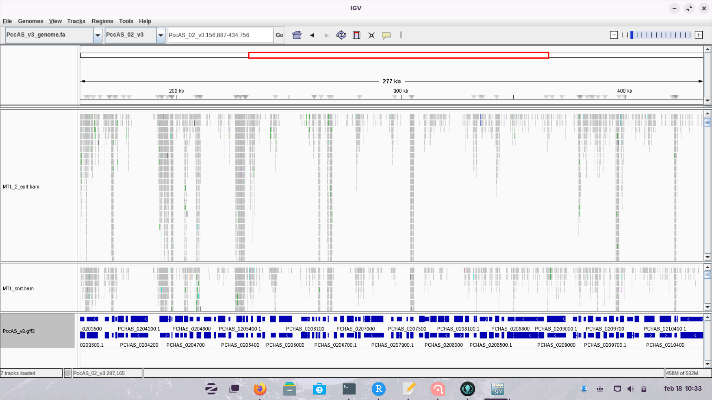
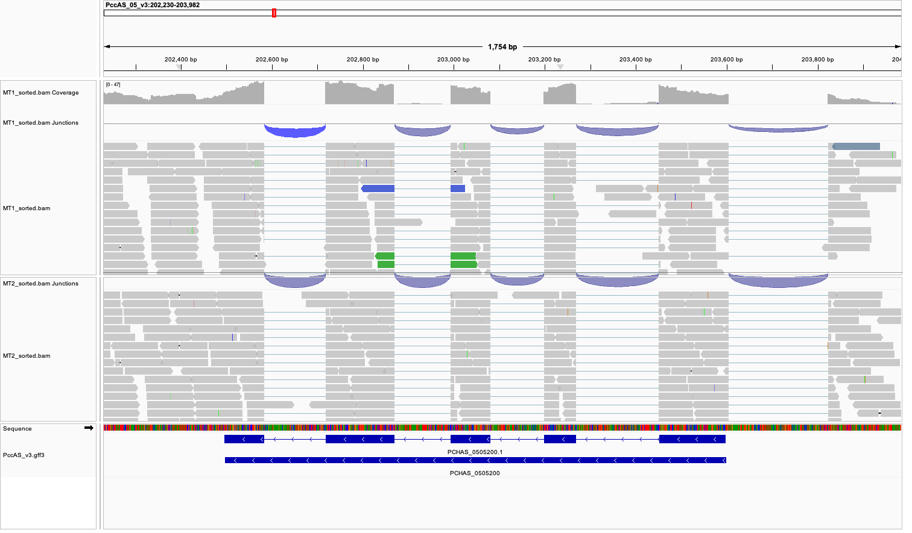
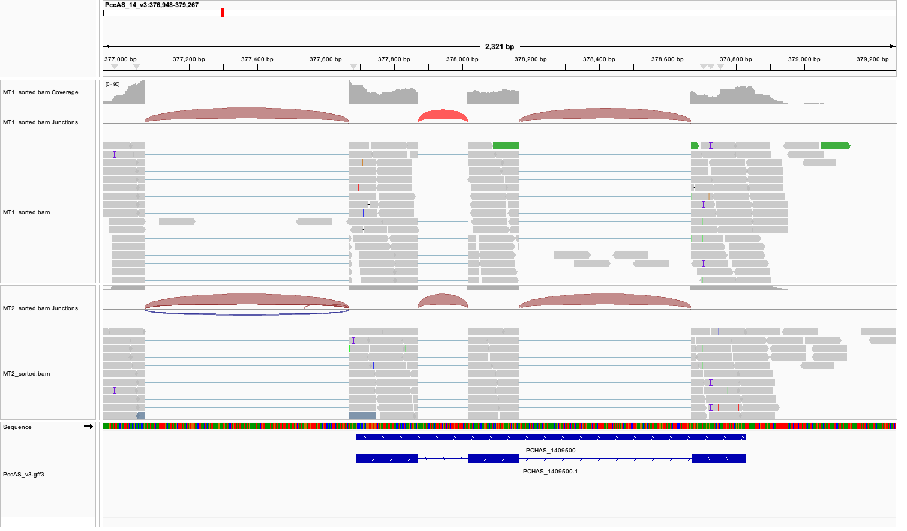

# IGV

## We will use IGV to visualize data for Plasmodium chabaudi AS (P. chabaudi)

> P. Chabaudi is a malaria mouse pathogen.

## Using the files in: /mnt/atgc-d1/bioinfoII/data/IGV, we will visualize RNA-seq data.

## Load the genome from a file (note it has been indexed)

### Load annotations for the genome.

<video width="320" height="240" controls>

<source src="video/video1.mp4" type="video/mp4">

Your browser does not support the video tag. </video>

### Which one is the annotation file?

**Suazo**: The annotation files are the ones with the extension .gff3 which stands for General Feature Format version 3.

### What is this format describing?

**Suazo**: The ggf3 format is a tab-delimited file that describes the features of a genome, such as DNA, RNA and protein sequences. It is a standard format for genome annotation.

## What is the browser displaying?

**Suazo**: The browser is displaying information about the annotations of genes, transcriptions and exons.

## What happens if you zoom in or out?

**Suazo**: When you zoom in, the browser displays more detailed information about the annotations such as nucleotides. When you zoom out, the browser displays less detailed information.

## Load an alignment file for an RNA-seq experiment MT1 and MT2

## Is the data in the correct format?

**Suazo**: No, the format provided is in FASTQ format, which is not compatible with IGV. We need to convert it to BAM format.

## What kind of data do you need?

> This is RNA-seq data so we need special aligners to take into account isoforms.

**Suazo**: We need to align the data to the genome.

## We will use HISAT2 to map the RNA-Seq reads from our samples to the reference genome.

## HISAT2 is a fast and sensitive splice-aware aligner.

## We need to index the genome

```{bash, eval = F}
hisat2-build PccAS_v3_genome.fa PccAS_v3_hisat2.idx
```

## Now we can align

```{bash, eval = F}
hisat2 --max-intronlen 10000 -x PccAS_v3_hisat2.idx -1 MT1_1.fastq -2 MT1_2.fastq -S MT1.sam
```

## We need to convert the sam to bam and sort the file... We also need an index so IGV can access the data quickly.

```{bash, eval = F}
# We align the Pair Ended reads

hisat2 --max-intronlen 10000 -x PccAS_v3_hisat2.idx -1 MT1_1.fastq -2 MT1_2.fastq -S MT1.sam


hisat2 --max-intronlen 10000 -x PccAS_v3_hisat2.idx -1 MT2_1.fastq -2 MT2_2.fastq -S MT2.sam


# We convert the SAM files to BAM files

samtools view MT1.sam -O BAM -o MT1.bam
 
samtools view MT1.sam -O BAM -o MT2.bam

# We sort the BAM files

samtools sort MT1.bam -o MT1.sorted.bam

samtools sort MT2.bam -o MT2.sorted.bam

# We index the BAM files

samtools index MT1.sorted.bam

samtools index MT2.sorted.bam


```


**Ferro**:
## We should do the same for sample MT2

## Now we can load the BAM files to IGV... Remember you need the index

### What do you see?, explore the genome.



### Visualize loci: PCHAS_0505200 and PCHAS_1409500

### What do you see?

### Can you export the figure?
Yes, IGV has a tool that you can export the figure 




# IGV Mouse

## Using IGV try to visualize the data for mouse ChIP-seq you generated. Is a liver data set, can you point to an interesting loci?

## Use UCSC Genome Browser

### How can you upload the data?

•Bam

•Bigwig

### What is BigWig?

### Create a BigWig using deepTools

```{bash, eval = F}
bamCoverage -b reads.bam -o coverage.bw
```

> You might need to try <https://de.cyverse.org/> or any server could work.

## Can you contextualize your results to other available data sets?
