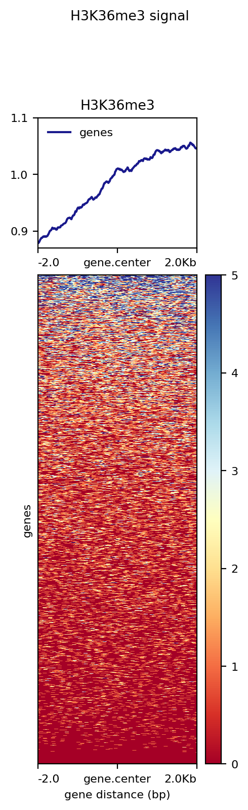

First, we will recall what the **ChIP-seq** method is.
Chromatin immunoprecipitation sequencing, or better known as ChIP-seq, is used to analyze protein-DNA interactions. The ChIP method or chromatin immunoprecipitation remains one of the most used techniques in molecular biology. It consists of cross-linking proteins to DNA with formaldehyde and then fragmenting the DNA. And the associated DNA is then analyzed.

Using formaldehyde or ultraviolet light we can obtain cross-linking of proteins from DNA, remembering that the concept of cross-linking is "...the process of chemically joining two or more molecules by a covalent bond." (ThermoFisher scientific). In the case of proteins from DNA, we use immunoprecipitation to study the interactions between proteins and DNA. After that, the DNA is fragmented and finally the associated DNA is analyzed.
First, let's remember what the ChIP-seq method is.
Chromatin immunoprecipitation sequencing, or better known as ChIP-seq, is used to analyze protein-DNA interactions. The ChIP method or chromatin immunoprecipitation remains one of the most widely used techniques in molecular biology. It consists of cross-linking proteins to DNA with formaldehyde and then fragmenting the DNA. And then the associated DNA is analyzed.

Using formaldehyde or ultraviolet light we can obtain the cross-linking of proteins from DNA, remembering that the concept of cross-linking is "...the process of chemically joining two or more molecules by a covalent bond." (ThermoFisher scientific). In the case of proteins from DNA, we use immunoprecipitation to study the interactions between proteins and DNA. Then the DNA is fragmented and finally the associated DNA is analyzed.

Researchers linked the ChIP technique with next-generation sequencing (NGS), to identify DNA fragments and map them to a reference genome, this is the ChIP-seq method. Its function is to "...identify DNA-associated protein binding sites and provide information on protein binding across the genome." (Immy Mobley, 2021). This method determines how chromatin-associated proteins associate, such as how transcription factors influence mechanisms that change phenotype.

Ref: <https://frontlinegenomics-com.translate.goog/what-are-chip-seq-and-bisulfite-sequencing/?_x_tr_sl=en&_x_tr_tl=es&_x_tr_hl=es&_x_tr_pto=tc>
<https://pubmed-ncbi-nlm-nih-gov.translate.goog/8993035/> 
<https://www-thermofisher-com.translate.goog/us/en/home/life-science/protein-biology/protein-biology-learning-center/protein-biology-resource-library/pierce-protein-methods/overview-crosslinking-protein-modification.html?_x_tr_sl=en&_x_tr_tl=es&_x_tr_hl=es&_x_tr_pto=tc>

# Create the H3K36me3 plot. Explain the commands used and the reason behind them.

## Heatmap of only one signal.

### 1. Creating a score Matrix of one of the H3K36me3 Chip seq

First we use the command computeMatrix.
This command creates a matrix with scores assigned to the regions defined in the .bed file, usually genes.
The file created can then be graphed with plotHeatmap of plotProfiles.
This command allows us as well to filter and sort according to scores.

We used the following options:

-   reference-point: This is a sub command that allow us to chose a region of the bed file(s) and then plot for a fixed number of bp upstream and/or downstream.
    -   S: File(s) to be plotted according to their scores. They need to be bw files. In our case we used only the bw corresponding to the chip seq of H3K36me3.
    -   R: File(s) to use as a reference for regions in the plot. We can use GTF of BED files. If we use multiple of these, they will be considered as different plots. We used a single bed that was proportioned in the materials.
    -   --referencePoint: This option allow id to define the reference point for ploting. It can either be in the end (TSE), in the start (TSS) or in the center. The default is TSE, but in this case we used center.
-   -out: refers to the name of the output file.

```{bash, eval = F}
[sgamino@compute-00-00 deepTools]$ computeMatrix reference-point -S H3K36me3.bw -R Human38_genesGencodev39.bed --referencePoint center -a 2000 -b 2000 -out matrix_H3K36me3_matrix.tab.gz
```

According to the options then, we will end up with a score matrix whom will contain the signals in a region +2000 and -2000 bp from the center of the bed file.

> Ref: <https://deeptools.readthedocs.io/en/develop/content/tools/computeMatrix.html>

<<<<<<< Updated upstream
### 2. Create the heatmap of the score matrix with plotHeatmap

We then used the command plotHeatmap, which as its name suggests, plots our score matrix in a heatmap.
This command allows us to costumize our heatmaps in a myriad of ways.
=======
## 2. Create the heatmap of the score matrix with plotHeatmap 

>>>>>>> Stashed changes

The options used were: - -m: Is the score matrix.
- -out: This option allows us to save the heatmap in a file.
- --heatmapHeight: Sets the height of the heatmap.
- --refPointLabel: Allows us to put a legend in the heatmap describing the reference point.
- --regionsLabel: Is an option used to set the type of regions that are represented in the bed, and put a legend with that info in the heatmap.
- --plotTitle: Allows us to put a title in the heatmap.

```{bash, eval = F}
[sgamino@compute-00-00 deepTools]$ plotHeatmap -m matrix_H3K36me3_matrix.tab.gz -out H3K36me3_genes.png --heatmapHeight 15 --refPointLabel gene.center --regionsLabel genes --plotTitle ' H3K36me3 signal'
```

> Ref: <https://deeptools.readthedocs.io/en/develop/content/tools/plotHeatmap.html>

### 3. Analysis of the heatmap

The heatmap of the chip seq is the following:



As we can see, the heatmap contains a los of information but it is usorted and ulfiltered, so it looks a little messy. If we added parameters like --skipzeros or one of the many sort options available in computeMatrix and plotHeatmap.

## Comparing multiple signals in one plot

This time, we will compare the heatmaps of multiple alignments in a single graph.

### 1. Creating a score matrix for each bw

Because we are working with various files, each one of them will have their own score matrix. In this case, we used some new options such as:
 
- scale-regions: In this mode (as opposed to the reference point), we will shruk or expand the regions of the bed depending on the length proportioned by the user.
- --beforeRegionStartLength: Distance upstream of the start site of the regions defined in the region file. If the regions are genes, this would be the distance upstream of the transcription start site.- The default is O
- --regionBodyLength: Distance in bases to which all regions will be fit. The default is 1000.
- --afterRegionStartLength: Distance downstream of the end site of the given regions. If the regions are genes, this would be the distance downstream of the transcription end site. The default is 0 as well.
- ..skipZeros: This option allows us to skip regions which have no signal or score. The default is to include them.

```{bash, eval = F}
[sgamino@compute-00-00 deepTools]$ computeMatrix scale-regions -S H3K27me3.bw H3K36me3.bw H3K4me3.bw -R Human38_genesGencodev39.bed -- beforeRegionStartLength 1000 --regionBodyLength 1000 -- afterRegionStartLength 1000 --skipZeros -o matrix.mat.gz
```

### 2. Create the heatmap of the score matrix with plotHeatmap

The command used was the following and no options were used:

```{bash, eval = F}
[sgamino@compute-00-00 deepTools]$ plotHeatmap -m matrix.mat.gz -out ExampleHeatmap1.png
```

### Analysis of the heatmaps

The result of the matrixes can be represented in three different heatmaps: 


# Create the mouse ChIP-seq plot. Explain the commands used and the reason behind them. Is the plot of those regions informative?


We did a heatmap of the sample of mouse than we used in the last homework, but we want to remember that the fastq of this sample had a bad quality and for this reason the heatmap hadn't a good resolution of signals.


First we check the first command that we used: 

```{bash, eval = F}
# Generate a matrix of coverage values
computeMatrix scale-regions -S coverage.bw -R hgTables.bed --beforeRegionStartLength 1000 --regionBodyLength 1000 --afterRegionStartLength 1000 --skipZeros --outFileName matrix_mouse.mat.gz
```


The first part of the code we generate a matrix of covarage values, they have this parts. 

*computeMatrix*: This tool calculates scores for regions of the genome and creates an intermediate file that can be used with the plotHeatmap and plotProfiles. 

**Subcomands**:
In the part of subcomads, we use:

*scale-regions*:
The user chooses up to what length (in bases) the regions of the BED file should be stretched or shrunk.
To use this subcomand we need three arguments, that they are in our code:

*--regionsFileName, -R*
Here we need write the name or names of the archives in format BED or GTF, they contains the regions to draw.

*--scoreFileName, -S*
Here we write the name of the Bigwig file that contains the scores to be drawn. We can get the Bigwig files with the tools bamCoverage or bamCompare.


**Opcional arguments**:

*--beforeRegionStartLength, -b, --upstream*: This argument is the distance upstream distance from the start site of the regions defined in the region file. In the case of our code it add 1000 bp (base pairs) before the start of each gene.

*--afterRegionStartLength, -a, --downstream*: This argument is the Distance downstream from the final site of the given regions. In the case of our code it add 1000 bp (base pairs) after the start of each gene.

*--regionBodyLength, -m*: This argument is the distance in bases to which all regions will adjust. In our code, we set the scale so that the body length of each gene is 1000 bp, regardless of its actual size.


In these optional arguments we set it to 1000 bp because given that the sample has a bad quality and this is the default number in this tools, also it allows us to focus on areas where there is most likely to be a genuine signal, avoiding noise from distant regions.


**Exit options**:


*--outFileName, -out, -o*:In this option we write the name that we want to call the output. This gzipped matrix is necessary to tools **plotHeatmap** and **plotProfile**.

Ref: <https://deeptools.readthedocs.io/en/develop/content/tools/computeMatrix.html>

```{bash, eval = F}
# Create the heatmap
plotHeatmap -m matrix_mouse.mat.gz -out Heatmap_mouse.png
```

In the case of the second code we use:

*plotHeatmap*: This tool generates a heat map that shows us the intensity of epigenetic marks around genes.

**Required arguments**:

*--matrixFile, -m*:  We put in this argument the archive of the matrix of the tool computeMatrix.

*--outFileName, -out, -o*: In this argument put the name that we want to the image for the Heatmap. It could be: *png*, *eps*, *pdf* and *svg*.

Ref: <https://deeptools.readthedocs.io/en/develop/content/tools/plotHeatmap.html#id2>

Now, we analyze the Heatmap that we did of the mouse sample:

First, we focus of the superior graph, it show us the Average coverage. The *X axis*, show the distance in pair of bases. We have 3 parts:

*TSS: Transcription Start Site*: This part represent the 1000 pb before of the gene, and it is represented -1.0 kb. 

*TES: Transcription End Site*: This is the final of the gene, and it is represented TES.

*Region downtream*: It is 1000 pb after the final of the gene, it is represented, +1.0 kb.

In the *Y axis* show the average signal strength in each region, and we can see a peak around of TSS and another smaller around of TES, it means that:
- In the part of TSS, this is where starts the transcription of the gene, before the coding region and despite limitations in sample quality, BigWig reads still show correlation with biologically relevant regions.
- The TES region and downstream portions show that due to poor sample quality they have very low overall coverage.

Now we analyze the heatmap:

Each row represents one gene. The color indicates the *intesity of the coverage*:
- *<font color="#A52A2A">Dark red:</font>* Indicates low or no signal.
- *<font color="#00008B">Dark Blue:</font>*Indicates High signal. 

We see the majority of the regions are in red, indicates poor covarage, because the sample of the mouse had a bad quality. The less blue areas are found a high signal acumulation in the TSS, and agrees with the peak in the last graph; it means that the Histone modifications represented in the BigWig file are more concertrated in the promoter regions of the genes, that is, the promoters of many genes are marked or potentially active.

Ref: <https://bioinformatics.ccr.cancer.gov/docs/data-visualization-with-r/Lesson5_intro_to_ggplot/>
<https://deeptools.readthedocs.io/en/develop/content/example_gallery.html>
<https://www.biostars.org/p/180314/>


# TidyTuesday plot. Choose a dataset that is of your interest and make a graph with them.
