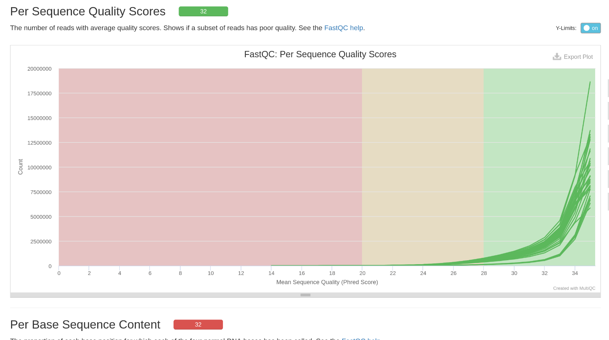
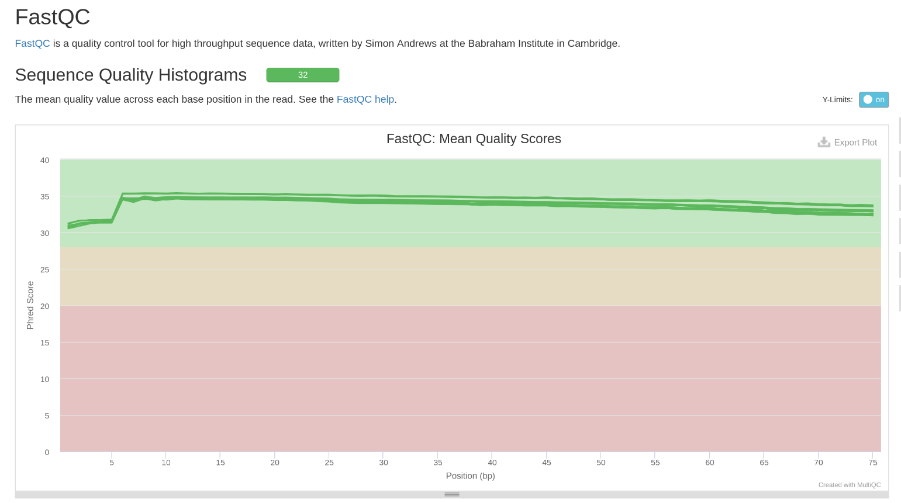
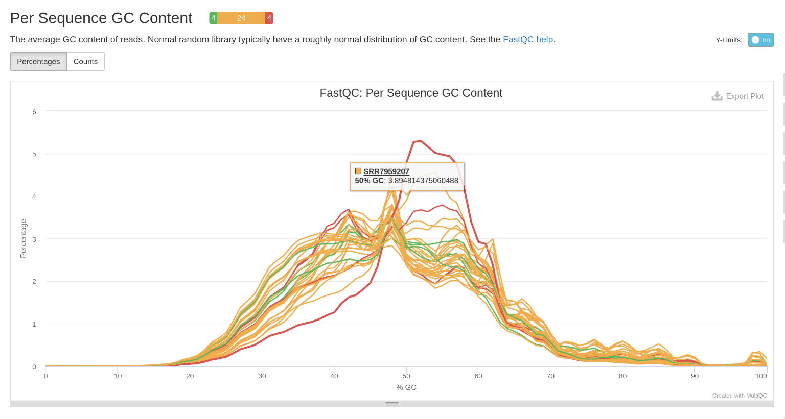
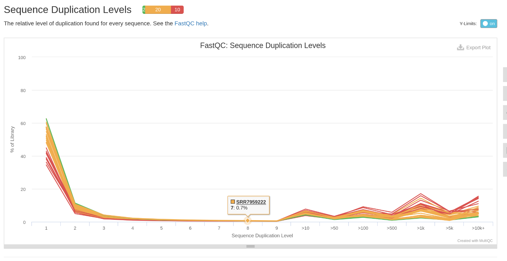
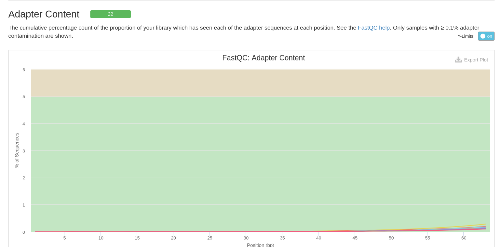

## Descripcion del equipo

-   **Equipo**: #1

-   **Integrantes**:

    -   Sofia Gamiño Estrada `sgamino`
    -   Jorge Alfredo Suazo Victoria `jsuazo`
    -   Emiliano Ferro Rodriguez `eferro`

-   **Correo Electronico**:

    -   [ghobibohg\@gmail.com](mailto:ghobibohg@gmail.com)
    -   [emiferro\@comunidad.unam.mx](mailto:emiferro@comunidad.unam.mx)
    -   [jasvpj\@gmail.com](mailto:jasvpj@gmail.com)

## Descripcion de los datos

| Descripción | Información |
|------------------------------------|------------------------------------|
| Bioproject | [PRJNA494527](https://www.ebi.ac.uk/ena/browser/view/PRJNA494527) |
| Especie | *Homo Sapiens* |
| Tipo de biblioteca | single-end |
| Método de Seleccion | RNA-Total |
| Número de transcriptomas | 34 |
| Número de réplicas biológicas | 17 Replicas Biologicas por condicion ( Control y Firma génica inducida por glucocorticoides en la piel humana) |
| Secuenciador Empleado | Illumina NextSeq 500 |
| Profundidad de secuenciación de cada transcriptoma | 12M a 40M |
| Tamaño de las lecturas | 75 bp |
| Articulo Cientifico | Sarkar MK, Kaplan N, Tsoi LC, Xing X et al. Endogenous Glucocorticoid Deficiency in Psoriasis Promotes Inflammation and Abnormal Differentiation. J Invest Dermatol 2017 Jul;137(7):1474-1483. PMID: [28259685](https://pubmed.ncbi.nlm.nih.gov/28259685/) Los datos se pueden descargar desde [NCBI](https://www.ncbi.nlm.nih.gov/geo/query/acc.cgi?acc=GSE120783) o usando [ENA](https://www.ebi.ac.uk/ena/browser/view/PRJNA494527?show=publications). 

```{r,include=FALSE, echo=FALSE}
library(DT)
library(jsonlite)
library(dplyr)
df <- fromJSON("~/Downloads/filereport_read_run_PRJNA494527_json.json")
json_text <- '[{"run_accession":"SRR7959189","sample_title":"aaF1","sample_alias":"GSM3415442"}, ...]'  # Aquí iría todo el JSON

df <- df[order(df$sample_alias), ]

Individuals <- c(1,2,3,4,5,6,7,8,9,10,12,13,14,15,16,17,18)
Individuals <- rep(Individuals, each=2)
df$Individuals <- Individuals
type <- rep(c("Control", "GC"), 17)

Dataset <- read.csv("/home/suaria/Documents/3Codon.github.io/content/post/ale_tarea_06/filereport_read_run_PRJNA494527_tsv-2.csv", header = TRUE, sep = ",")
df$Type <- type
rownames(df) <- NULL
```

```{r, echo = FALSE}
knitr::kable(df)
```


# Calidad de las secuencias de los datos crudos



](images/clipboard-2945811438.png)

](images/clipboard-2627870887.png)

](images/clipboard-2104822047.png)



](images/clipboard-951062137.png)

# Conclusión sobre los datos

## ¿Son viables para continuar el análisis?

No, los datos como están no son viables para continuar con el análisis ya que hay muchas secuencias duplicadas (adaptadores) que pueden interferir al momento de alinear, ya que si los dejamos así pueden llegar a alinear en muchos sitios.

Esto es evidente gracias a la alta cantidad de transcriptomas con un contenido de GC no adecuado, el hecho de que todos los fastq muestran una cantidad desbalanceada de bases por secuencia, las secuencias sobrerepresentadas en una cantidad alta y los niveles altos de duplicación.
Todos estos son signos de que los archivos fastq estan crudos.

Algo importante a notar es el contenido de GC.
Errores en este test pueden deberse a contaminaciones del tejido epitelial por virus o bacterias, lo cual no es nada raro en la piel humana.
Es importante considerar esto, ya que en caso de que no mejore se tendría que volver a mandar a secuenciar pero ahora en condiciones esteriles y más estrictas.
H

## ¿Qué pasos deben seguirse para mejorar la calidad de los datos?

Aparte de los adaptadores en las reads, tenemos una calidad de transciptomas muy buena y con buena covertura, por lo cual la secuenciación fue sin problemas.

El principal problema que veo aparte de los adpatadores es checar que tanta contaminación tienen nuestras muestras con microorganismos, y que tanto pueden afectar la calidad de nuestras lecturas.
En caso de que sea muy prevalente, sería bueno separar las lecturas entre las células epiteliales y los micro-organismos.

Entonces:

1.  Hacer trimming de los adaptadores, cuidando que la longitud de nuestras reads se mantenga entre 50 y 60.
2.  Volver a hacer un multiqc como este y volver a evaluar las calidades.
3.  Checar si ha cambiado el contenido de GC. En caso de que no, seguir con los siguientes pasos.
4.  Identificar la especie a la que pertenecen los transcritos contaminantes, y agruparlos para dejarlos fuera de nuestras lecturas.
5.  Volver a hacer un multiqc, y repetir los pasos a partir del 3 en caso de ser necesario.
