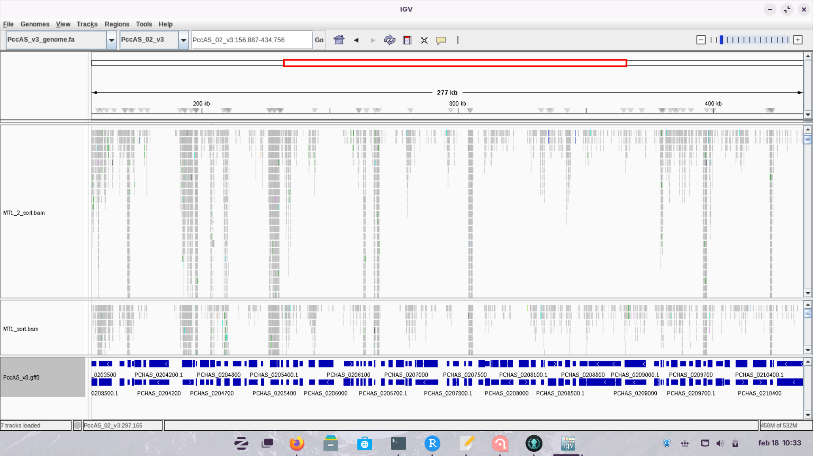
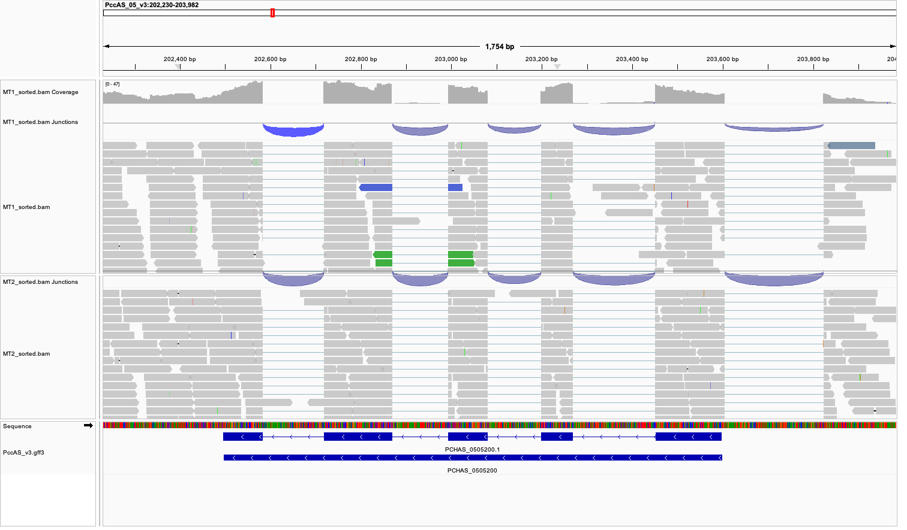
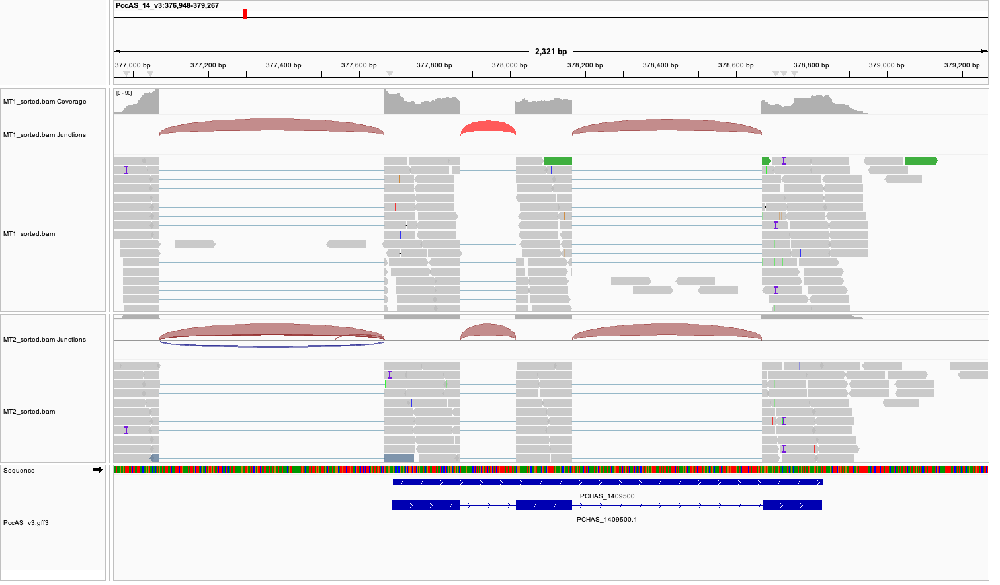
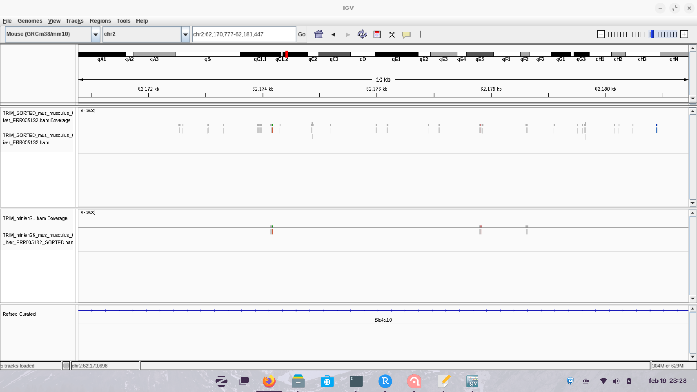

<meta http-equiv="Content-Security-Policy" content="{{ .Site.Params.contentSecurityPolicy }}">

# IGV

## We will use IGV to visualize data for Plasmodium chabaudi AS (P. chabaudi)

> P. Chabaudi is a malaria mouse pathogen.

## Using the files in: /mnt/atgc-d1/bioinfoII/data/IGV, we will visualize RNA-seq data.

## Load the genome from a file (note it has been indexed)

### Load annotations for the genome.

<video width="320" height="240" controls>

<source src="https://data.cyverse.org/dav-anon/iplant/home/3lconejo/video1.mp4" type="video/mp4">

Your browser does not support the video tag. </video>

### Which one is the annotation file?

**Suazo**: The annotation files are the ones with the extension .gff3 which stands for General Feature Format version 3.

### What is this format describing?

**Suazo**: The ggf3 format is a tab-delimited file that describes the features of a genome, such as DNA, RNA and protein sequences. It is a standard format for genome annotation.

## What is the browser displaying?

**Suazo**: The browser is displaying information about the annotations of genes, transcriptions and exons.

## What happens if you zoom in or out?

**Suazo**: When you zoom in, the browser displays more detailed information about the annotations such as nucleotides. When you zoom out, the browser displays less detailed information.

## Load an alignment file for an RNA-seq experiment MT1 and MT2

## Is the data in the correct format?

**Suazo**: No, the format provided is in FASTQ format, which is not compatible with IGV. We need to convert it to BAM format.

## What kind of data do you need?

> This is RNA-seq data so we need special aligners to take into account isoforms.

**Suazo**: We need to align the data to the genome. **Sofia**: For that reason, we need data in the form of bam and their index, bam.bai.

## We will use HISAT2 to map the RNA-Seq reads from our samples to the reference genome. HISAT2 is a fast and sensitive splice-aware aligner.

## We need to index the genome

```{bash, eval = F}
hisat2-build PccAS_v3_genome.fa PccAS_v3_hisat2.idx
```

## Now we can align

```{bash, eval = F}
hisat2 --max-intronlen 10000 -x PccAS_v3_hisat2.idx -1 MT1_1.fastq -2 MT1_2.fastq -S MT1.sam
```

## We need to convert the sam to bam and sort the file... We also need an index so IGV can access the data quickly.

```{bash, eval = F}
# We align the Pair Ended reads

hisat2 --max-intronlen 10000 -x PccAS_v3_hisat2.idx -1 MT1_1.fastq -2 MT1_2.fastq -S MT1.sam

hisat2 --max-intronlen 10000 -x PccAS_v3_hisat2.idx -1 MT2_1.fastq -2 MT2_2.fastq -S MT2.sam


# We convert the SAM files to BAM files

samtools view MT1.sam -O BAM -o MT1.bam
 
samtools view MT2.sam -O BAM -o MT2.bam

# We sort the BAM files

samtools sort MT1.bam -o MT1.sorted.bam

samtools sort MT2.bam -o MT2.sorted.bam

# We index the BAM files

samtools index MT1.sorted.bam

samtools index MT2.sorted.bam

```

**Ferro**: \## We should do the same for sample MT2

## Now we can load the BAM files to IGV... Remember you need the index

### What do you see?, explore the genome.

We observe that at the top of the reads they tell us the coverage of each coding sequence and the coverage can help us infer which exons are more expressed among all the exons in the sample. We can see that the reads are cut very precisely and between each set of reads of each exon there is a GAP or a space, this is due to the prediction of the splicing junctions and that the reads are cut, which is what IGV does to be able to map the reads in the reference genome. Also with this, IGV represents the splicing junctions as a red or blue curve.

Ref:<https://www.youtube.com/watch?v=awGN-rpLYas> <https://igv.org/doc/desktop/#UserGuide>



### Visualize loci: PCHAS_0505200 and PCHAS_1409500

```{bash, eval = F}
[sgamino@compute-00-11 IGV]$ grep "PCHAS_0505200" PccAS_v3.gff3
PccAS_05_v3	DEFAULT	gene	202496	203599	.	-	.	ID=PCHAS_0505200
PccAS_05_v3	DEFAULT	mRNA	202496	203599	.	-	.	ID=PCHAS_0505200.1;Parent=PCHAS_0505200
PccAS_05_v3	DEFAULT	CDS	202496	202583	.	-	1	ID=PCHAS_0505200.1:exon:2216;Parent=PCHAS_0505200.1
PccAS_05_v3	DEFAULT	CDS	202719	202869	.	-	2	ID=PCHAS_0505200.1:exon:2217;Parent=PCHAS_0505200.1
PccAS_05_v3	DEFAULT	CDS	202994	203081	.	-	0	ID=PCHAS_0505200.1:exon:2218;Parent=PCHAS_0505200.1
PccAS_05_v3	DEFAULT	CDS	203199	203269	.	-	2	ID=PCHAS_0505200.1:exon:2219;Parent=PCHAS_0505200.1
PccAS_05_v3	DEFAULT	CDS	203452	203599	.	-	0	ID=PCHAS_0505200.1:exon:2220;Parent=PCHAS_0505200.1

[sgamino@compute-00-11 IGV]$ grep "PCHAS_1409500" PccAS_v3.gff3
PccAS_14_v3     DEFAULT gene    377689  378830  .       +       .       ID=PCHAS_1409500
PccAS_14_v3     DEFAULT mRNA    377689  378830  .       +       .       ID=PCHAS_1409500.1;Parent=PCHAS_1409500
PccAS_14_v3     DEFAULT CDS     377689  377868  .       +       0       ID=PCHAS_1409500.1:exon:12588;Parent=PCHAS_1409500.1
PccAS_14_v3     DEFAULT CDS     378016  378165  .       +       0       ID=PCHAS_1409500.1:exon:12589;Parent=PCHAS_1409500.1
PccAS_14_v3     DEFAULT CDS     378669  378830  .       +       0       ID=PCHAS_1409500.1:exon:12590;Parent=PCHAS_1409500.1
```

This way, we can know the position of these loci.

**Ferro**: \### What do you see?

First, let's remember what the mRNA maturation process is: The result of the DNA transcription process is an RNA molecule called pre-mRNA, this molecule is characterized by containing introns and exons. The premature RNA molecule enters a process called spicing where the spliceosome removes the introns and only leaves the coding sequences (CD). Then the regions where the spliceosome cuts are called splicing junctions, which are the regions where the exons are joined and thus we obtain the mature mRNA ready to begin the translation process. Now when we get the mRNA sequencing reads at the time of aligning them with the reference genome, but the problem is that some reads do not map to the reference genome, therefore to align what is done is that IGV predicts the splicing junctions and cuts the reads and aligns them with the coding sequences (CD), and with this the more coverage the different exons have, we can observe which exons are being expressed. Also IGV when predicting the splice junctions, represents the jumps between exons as arcs. If the arcs are red, it represents the splicing junctions of the positive strand, while the blue arcs represent the splicing junctions of the negative strand. The thickness and height of these curves are determined by the amount of reads you have in a given junction.

In our sample, we can see that the PCHAS_0505200 loci has 5 coding sequences and each of them has a good coverage, and the coding sequences are of different sizes. All the representations of the splicing junctions are from the negative strand, since it is colored blue. On the other hand, the PCHAS_1409500 loci only has 3 coding sequences, we can see that the curves that represent the junctions are red, this indicates that these arcs are splicing junctions from the positive strand. In both samples we can also see at the top that it tells us how many coverages each exon has, in our sample, it tells us that there are high coverages in each coding sequence that the loci has.

Ref:<https://www.youtube.com/watch?v=awGN-rpLYas> <https://igv.org/doc/desktop/#UserGuide>

### Can you export the figure?

Yes, IGV allows you to export the image of what you are working on. To be able to extract the image you must first center what you want to show, then at the top of the tool there are several options including "File" and there are two formats in which you can extract the image, such as a png image or an SVG image, you select the format you want and it will export the image to your files. We extract the images in png.





# IGV Mouse

## Using IGV try to visualize the data for mouse ChIP-seq you generated. Is a liver data set, can you point to an interesting loci?

No, because when we aligned the RNA-seq sequences from the loci after trimming, we remained with around 400k reads with adequate quality. This amount of reads is neglible, so any assesment is almost impossible to do. For example, this is the kind of information we get from a loci:



## Use UCSC Genome Browser

## How can you upload the data?

### Bam

### Bigwig

#### What is BigWig?

**Sofia**: BigWig (bw) is a type of format useful to display information on genome browsers visualizers, as it does not needs to charge all reads, but only those in the region displayed, called "sparse". BigWig files contain information of aligned reads for each sparse.

It is an indexed file and the info is saved in a server external to the genome browser.

BigWig files are created from wiggle (wig) type files using the program wigToBigWig, but we can also use bamCoverage or bamCompare to transform bam files to bigwig files.

#### Create a BigWig using deepTools

```{bash, eval = F}
[sgamino@chromatin deepTools]$ bamCoverage -b .TRIM_minlen36_mus_musculus_CEBPA_liver_ERR005132_SORTED.bam -o TRIM_minlen36_mus_musculus_CEBPA_liver_ERR005132_SORTED.bw

```

> You might need to try <https://de.cyverse.org/> or any server could work.

## Can you contextualize your results to other available data sets?

::: {#adobe-dc-view}
:::

```{=html}
<script src="https://acrobatservices.adobe.com/view-sdk/viewer.js"></script>
```

<div>

</div>

```{=html}
<script type="text/javascript">
  document.addEventListener("adobe_dc_view_sdk.ready", function() {
    var adobeDCView = new AdobeDC.View({
      clientId: "c57675621c8d42c1943b44c8a1f0b0ff", // Reemplaza con tu clientId de Adobe
      divId: "adobe-dc-view"
    });
    adobeDCView.previewFile(
      {
        content: {
          location: {
            url: "https://data.cyverse.org/dav-anon/iplant/home/3lconejo/USCS.pdf", // Ruta al PDF subido
          },
        },
        metaData: { fileName: "example.pdf" },
      },
      { embedMode: "IN_LINE" }
    );
  });
</script>
```

**Sofia**: Yes we can. In the UCSC genome browser we can compare in real time our results to those obtained in a variety of experiments and projects like the ENCODE project. For example, we can know the results of CHIPseq alignment of many types of proteins, and then compare with our own CHIP seq experiments to see if they are congruent to the known literature.
